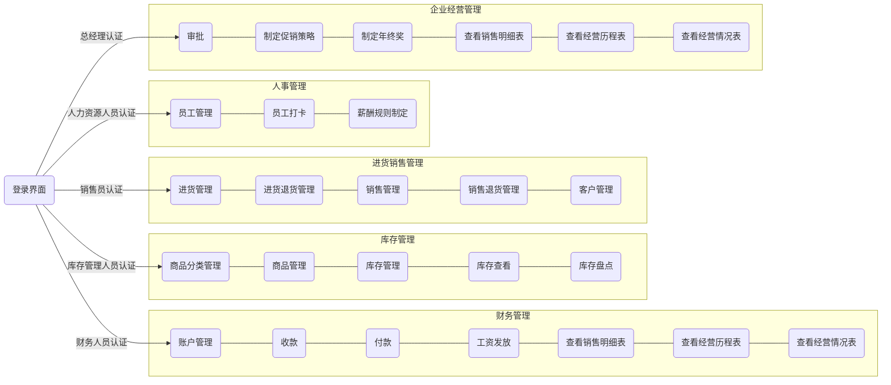

# NJU-ERP 系统体系结构文档v1

[TOC]

## 引言

### 编制目的

本报告详细完成对 NJU-ERP 系统的体系结构设计，达到指导详细设计和开发的目的，同时实现和测试人员及用户的沟通。

本报告面向开发人员、测试人员及最终用户而编写，是了解系统的导航。

### 词汇表

TODO：词汇表

| 词汇名称     | 词汇含义                     | 备注 |
| :----------- | :--------------------------- | ---- |
| NJU-ERP 系统 | 蓝鲸软件科技企业资源计划系统 |      |
|              |                              |      |
|              |                              |      |

### 参考资料

1. IEEE1471-2000
2. NJU-ERP 系统用例文档v1
3. NJU-ERP 系统软件需求规格说明文档v1

## 产品概述

参考《NJU-ERP系统用例文档》和《NJU-ERP系统软件需求规格说明文档》中对产品的概括描述。

## 体系结构模型

*TODO：这一部分文档结构较为灵活，可以根据实际情况增补条目和标题*

### 整体架构描述

### 逻辑视角

NJU-ERP 系统中，选择了分层体系结构风格，将系统分为 3 层（展示层、业务逻辑层、数据层）能够很好地示意争个高层抽象。展示层包括 GUI 页面的实现，业务逻辑层包含业务逻辑处理的实现，数据层负责数据的持久化和访问。分层体系结构的逻辑视角和逻辑设计方案如图所示。

图 1：参照体系结构风格的包图表达逻辑视角（https://processon.com/diagraming/62709109079129397f2ee488）

图 2：软件体系结构逻辑设计方案（https://processon.com/diagraming/6270b2955653bb5be570b723）

### 组合视角

#### 开发包图

NJU-ERP 系统的最终开发包图如下表所示。

| 开发（物理）包 | 依赖的其他开发包 |
| -------------- | ---------------- |
|                |                  |
|                |                  |
|                |                  |
|                |                  |

#### 运行时进程

在系统中，会有多个客户端进程（浏览器）和一个服务器进程，其进程图如下。结合部署图，客户端进程是在客户端机器商运行，服务器进程是在服务器端机器上运行。

进程图（https://processon.com/diagraming/627c71cff346fb64d55adc0f）

#### 物理部署

NJU-ERP 系统使用浏览器作为客户端进程，前端和后端服务端部署在服务器。

部署图（https://processon.com/diagraming/6242da841e0853078939ac2c）

### 接口视角

#### 模块的职责

#### 用户界面层的分解

根据需求，系统存在以下界面：登陆界面、商品分类管理界面、商品管理界面、库存管理界面、库存查看界面、库存盘点界面、进货管理界面、进货退货管理界面、销售管理界面、销售退货管理界面、客户管理界面、审批界面。界面跳转如下图所示

##### 用户界面模块的职责

TODO：

##### 用户界面模块的接口规范

TODO：

### 业务逻辑层的分解

业务逻辑层包括多个针对界面的业务逻辑处理对象。

#### 业务逻辑层模块的职责

TODO：

#### 业务逻辑层模块的接口规范

### 数据层的分解

#### 数据层主要为业务逻辑层提供数据访问服务，包括对可持久化对象的增删改查。

#### 数据层模块的职责

#### 数据层模块的接口规范

### 信息视角

#### 数据持久化对象

#### 数据库表