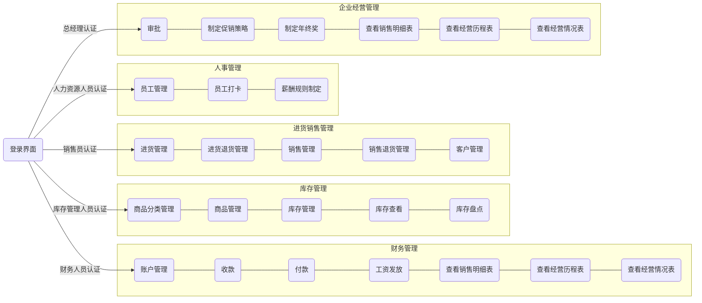

# NJU-ERP 系统体系结构文档v1

[TOC]

## 引言

### 编制目的

本报告详细完成对 NJU-ERP 系统的体系结构设计，达到指导详细设计和开发的目的，同时实现和测试人员及用户的沟通。

本报告面向开发人员、测试人员及最终用户而编写，是了解系统的导航。

### 词汇表

TODO：词汇表

| 词汇名称     | 词汇含义                     | 备注 |
| :----------- | :--------------------------- | ---- |
| NJU-ERP 系统 | 蓝鲸软件科技企业资源计划系统 |      |
|              |                              |      |
|              |                              |      |

### 参考资料

1. IEEE1471-2000
2. NJU-ERP 系统用例文档v1
3. NJU-ERP 系统软件需求规格说明文档v1

## 产品概述

参考《NJU-ERP系统用例文档》和《NJU-ERP系统软件需求规格说明文档》中对产品的概括描述。

## 体系结构模型

*TODO：这一部分文档结构较为灵活，可以根据实际情况增补条目和标题*

### 整体架构描述

### 逻辑视角

NJU-ERP 系统中，选择了分层体系结构风格，将系统分为 3 层（展示层、业务逻辑层、数据层）能够很好地示意整个高层抽象。展示层包括 GUI 页面的实现，业务逻辑层包含业务逻辑处理的实现，数据层负责数据的持久化和访问。分层体系结构的逻辑视角和逻辑设计方案如图所示。

图 1：参照体系结构风格的包图表达逻辑视角（https://processon.com/diagraming/62709109079129397f2ee488）

图 2：软件体系结构逻辑设计方案（https://processon.com/diagraming/6270b2955653bb5be570b723）

### 组合视角

#### 开发包图

***TODO：修改开发包设计***

NJU-ERP 系统的最终开发包设计如下表所示：

| 开发包               | 依赖的其他包                                                 |
| -------------------- | ------------------------------------------------------------ |
| mainui               | inventoryui, salesui, financeui, hrui, clientui, approvalui, strategyui, vo |
| inventoryui          | inventoryblservice, 界面类库包, vo                           |
| inventoryblservice   |                                                              |
| inventorybl          | inventoryblservice, inventorydataservice, po, utilitybl, salesbl |
| inventorydataservice |                                                              |
| inventorydata        | inventorydataservice, databaseutility                        |
| salesui              | salesblservice, 界面类库包, vo                               |
| salesblservice       |                                                              |
| salesbl              | salesblservice, salesdataservice, po, utilitybl              |
| salesdataservice     |                                                              |
| salesdata            | salesdataservice, databaseutility                            |
| financeui            | financeblservice, 界面类库包, vo                             |
| financeblservice     |                                                              |
| financebl            | financeblservice, financedataservice, po, utilitybl, salesbl |
| financedataservice   |                                                              |
| financedata          | financedataservice, databaseutility                          |
| hrui                 | hrblservice, 界面类库包, vo                                  |
| hrblservice          |                                                              |
| hrbl                 | hrblservice, hrdataservice, po, utilitybl, financebl         |
| hrdataservice        |                                                              |
| hrdata               | hrdataservice, databaseutility                               |
| clientui             | clientblservice, 界面类库包, vo                              |
| clientblservice      |                                                              |
| clientbl             | clientblservice, clientdataservice, po, utilitybl, salesbl   |
| clientdataservice    |                                                              |
| clientdata           | clientdataservice, databaseutility                           |
| approvalui           | approvalblservice, 界面类库包, vo                            |
| approvalblservice    |                                                              |
| approvalbl           | approvalblservice, approvaldataservice, po, utilitybl, inventorybl, salesbl, financebl |
| approvaldataservice  |                                                              |
| approvaldata         | approvaldataservice, databaseutility                         |
| strategyui           | strategyblservice, 界面类库包, vo                            |
| strategyblservice    |                                                              |
| strategybl           | strategyblservice, strategydataservice, po, utilitybl        |
| strategydataservice  |                                                              |
| strategydata         | strategydataservice, databaseutility                         |
| vo                   |                                                              |
| po                   |                                                              |
| databaseutility      |                                                              |

NJU-ERP 系统的最终开发包图如下图所示

NJU-ERP 系统开发包图（https://processon.com/diagraming/627093086376891e1c2106c1）

#### 运行时进程

在系统中，会有多个客户端进程（浏览器）和一个服务器进程，其进程图如下。结合部署图，客户端进程是在客户端机器商运行，服务器进程是在服务器端机器上运行。

进程图（https://processon.com/diagraming/627c71cff346fb64d55adc0f）

#### 物理部署

NJU-ERP 系统前端采用 Vue 框架，后端采用 SpringBoot 框架，使用 Mybatis框架范根数据库。

部署时需要在服务器端放置服务器端构件，其中包括 Vue 框架、Springboot 框架和 Mybatis 框架；不需要在客户端部署任何构件，客户端通过网络在浏览器中访问该系统。

部署图（https://processon.com/diagraming/6242da841e0853078939ac2c）

### 接口视角

#### 模块的职责

服务端模块的视图如下图所示，服务端各层的职责分别如下表所示。

| 层             | 职责                                     |
| -------------- | ---------------------------------------- |
| 启动模块       | 负责初始化网络通信机制，启动用户界面     |
| 服务器网络模块 | 负责响应网络通信请求                     |
| 用户界面层     | 基于网络页面的 ERP 系统用户界面          |
| 业务逻辑层     | 对于用户的操作进行响应并进行业务逻辑处理 |
| 数据层         | 负责数据的持久化及数据访问接口           |

每一层只是使用下方直接接触的层。层与层之间仅仅是通过接口的调用来完成的。层之间调用的接口如下表所示。

***TODO：完善下表***

| 接口                                                         | 服务调用方 | 服务提供方 |
| ------------------------------------------------------------ | ---------- | ---------- |
| CategoryServiceImpl  ProductServiceImpl  WarehouseServiceimpl   ... | 用户界面层 | 业务逻辑层 |
| CategoryDao   ProductDao   WarehouseDao   WarehouseInputSheetDao   WarehouseOutputSheetDao   CustomerDao   RestockSheetDao   RestockReturnedGoodsSheetDao   SalesSheetDao   SalesReturnedGoodsSheetDao |            |            |

#### 用户界面层的分解

根据需求，系统存在以下界面：登陆界面、商品分类管理界面、商品管理界面、库存管理界面、库存查看界面、库存盘点界面、进货管理界面、进货退货管理界面、销售管理界面、销售退货管理界面、客户管理界面、审批界面。

除了登陆界面外，所有界面根据使用的用户分成五个模块，每个模块内部页面可相互跳转。

界面跳转如下图所示：

用户界面类如下图所示。

##### 用户界面模块的职责

下表为用户界面层模块的职责。

| 模块      | 职责                                   |
| --------- | -------------------------------------- |
| MainFrame | 界面 Frame，负责界面的显示和界面的跳转 |

##### 用户界面模块的接口规范

下表为用户界面层的接口规范。

| 接口名称       | 语法                           | 前置条件 | 后置条件      |
| -------------- | ------------------------------ | -------- | ------------- |
| Mainframe.init | Mainframe.init(Strings[] args) | 无       | 正确显示Frame |

用户界面层需要的服务接口如下表所示。

***TODO：完善下表***

| 服务名                              | 服务                   |
| ----------------------------------- | ---------------------- |
| CategoryServiceImpl.getUIInfo       | 取得商品分类的 UI 内容 |
| ProductServiceImpl.getUIInfo        | 取得商品信息的 UI 内容 |
| WarehouseServiceImpl.getUIInfo      | 取得库存信息的 UI 内容 |
| ...（库存和销售模块中未实现的接口） | ...                    |

##### 用户界面模块设计原理

用户界面利用 Vue 框架设计和实现。

#### 业务逻辑层的分解

业务逻辑层包括多个针对界面的业务逻辑处理对象。例如，SalesServiceImpl 对象负责处理销售界面的部分业务逻辑；ProductServiceImpl 负责处理库存界面的部分业务逻辑。业务逻辑层的设计图如下所示：

##### 业务逻辑层模块的职责

业务逻辑层模块的职责如下表所示。

| 模块        | 职责                             |
| ----------- | -------------------------------- |
| WarehouseBL | 负责实现库存管理界面所需要的服务 |
| SalesBL     | 负责实现销售界面所需要的服务。   |

##### 业务逻辑层模块的接口规范

***TODO：完善接口规范***

###### WarehouseBL 模块的接口规范

提供的服务（供接口）

***TODO：完善下表***

| 接口名称                                | 语法                                                         | 前置条件             | 后置条件                       |
| :-------------------------------------- | ------------------------------------------------------------ | -------------------- | ------------------------------ |
| CategoryServiceImpl.createCategory      | public CategoryVO createCategory(Integer parentId, String name) | 需要新增一个商品分类 | 增加新增的商品分类信息         |
| CategoryServiceImpl.queryAllCategory    | public List\<CategoryVO\> queryAllCategory()                 | 需要查询商品分类     | 返回所有的商品分类             |
| CategoryServiceImpl.updateCategory      | public CategoryVO updateCategory(Integer id, String name)    | 需要更新商品分类     | 更新商品分类信息               |
| CategoryServiceImpl.deleteCategory      | public void deleteCategory(Integer id)                       | 需要删除一个商品分类 | 删除指定 Id 的商品分类         |
| CategoryServiceImpl.getUIInfo           | public String[] getUIInfo(String[] args)                     | 需要获取 UI 界面内容 | 返回所需的 UI 内容             |
| ProductServiceImpl.createProduct        | public ProductInfoVO createProduct(CreateProductVO inputVO） | 需要新增一个商品     | 增加新增的商品信息             |
| ProductServiceImpl.updateProduct        | public ProductInfoVO updateProduct(ProductInfoVO productInfoVO) | 需要更新商品信息     | 更新指定的商品信息             |
| ProductServiceImpl.queryAllProduct      | public List\<ProductInfoVO\> queryAllProduct()               | 需要查询商品信息     | 返回所有商品信息               |
| ProductServiceImpl.deleteById           | public void deleteById(String id)                            | 需要删除商品信息     | 删除指定 Id 的商品信息         |
| ProductServiceImpl.getUIInfo            | public String[] getUIInfo(String[] args)                     | 需要获取 UI 界面内容 | 返回所需的 UI 内容             |
| WarehouseServiceImpl.productWarehousing | public void productWarehousing(WarehouseInputFormVO warehouseInputFormVO) | 需要入库商品         | 更新库存中的商品信息(增加库存) |
| WarehouseServiceImpl.getUIInfo          | public String[] getUIInfo(String[] args)                     | 需要获取 UI 界面内容 | 返回所需的 UI 内容             |

需要的服务(需接口)

***TODO：完善下表***

| 服务名                                                       | 服务                                       |
| ------------------------------------------------------------ | ------------------------------------------ |
| CategoryDao.findByCategoryId(Integer categoryId)             | 根据 Id 得到 CategoryPO 对象               |
| CategoryDao.createCategory(CategoryPO categoryPO)            | 向数据库中插入 CategoryPO对象              |
| CategoryDao.updateById(CategoryPO categoryPO)                | 更新数据库中的 CategoryPO 对象             |
| CategoryDao.findAll()                                        | 查询所有 CategoryPO 对象                   |
| CategoryDao.deleteById(Integer id)                           | 删除数据库中指定 Id 的CategotyPO对象       |
| ProductDao.createProduct(ProductPO productPO)                | 向数据库中插入 ProductPO 对象              |
| ProductDao.updateById(ProductPO productPO)                   | 更新数据库中的 ProductPO 对象              |
| ProductDao.findById(String id)                               | 根据 Id 查找 ProductPO 对象                |
| ProductDao.findAll()                                         | 查询所有 ProductPO 对象                    |
| ProductDao.deleteById(String id)                             | 删除数据库中指定 Id 的 ProductDao 对象     |
| WarehouseDao.saveBatch(List\<WarehousePO\> warehousePOList)  | 向数据库中插入一批 WarehousePO 对象        |
| WarehouseDao.deductQuantity(WarehousePO warehousePO)         | 减少一批商品的库存数量                     |
| WarehouseDao.findAllNotZeroByPidSortedByBatchId(String pid)  | 按 pid 查询一批商品，按 batchId 排序       |
| WarehouseInputSheetDao.getLatest()                           | 查询最近一条入库单(WarehouseInputSheetPO)  |
| WarehouseInputSheetDao.save(WarehouseInputSheetPO toSave)    | 存入一条入库单记录(WarehouseInputSheetPO)  |
| WarehouseInputSheetDao.saveBatch(List\<WarehouseInputSheetContentPO> warehouseInputListPOSheetContent) | 把入库单上的具体内容存入数据库             |
| WarehouseOutputSheetDao.getLatest()                          | 查询最近一条出库单(WarehouseOutputSheetPO) |
| WarehouseOutputSheetDao.save(WarehouseOutputSheetPO toSave)  | 存入一条出库单记录(WarehouseOutputSheetPO) |
| WarehouseOutputSheetDao.saveBatch(List\<WarehouseOutputSheetContentPO> warehouseOutputListPOSheetContent) | 把出库单上的具体内容存入数据库             |

###### SalesBL模块的接口规范

提供的服务（供接口）

***TODO：完善下表***

| 接口名称                               | 语法                                                         | 前置条件           | 后置条件                                        |
| :------------------------------------- | ------------------------------------------------------------ | ------------------ | ----------------------------------------------- |
| CustomerServiceImpl.createCustomer     | public CustomerVO createCustomer(CustomerInfoVO customerInfoVO) | 新增一个客户       | 增加新增的客户信息                              |
| CustomerServiceImpl.updateCustomer     | public CustomerVO updateCustomer(CustomerInfoVO customerInfoVO) | 需要更新客户信息   | 更新客户信息                                    |
| CustomerServiceImpl.deleteCustomer     | public void deleteCustomer(CustomerInfoVO customerInfoVO)    | 需要删除一个客户   | 删除和关键字段信息匹配的客户的信息              |
| CustomerServiceImpl.getLargestInPeriod | public CustomerVO getLargestInPeriod(Date startDate, Date endDate) | 需要查询交易       | 返回 startDate - endDate 日期内交易额最大的客户 |
| SalesServiceImpl.deliverGoods          | public SalesSheetVO deliverGoods(SalesSheetInfoVO salesSheetInfoVO) | 需要出货           | 更新本次出货涉及的库存和客户信息                |
| SalesServiceImpl.returnGoods           | public SalesReturnedGoodsSheetVO returnGoods(SalesReturnedGoodsSheetInfoVO salesReturnedGoodsInfoVO) | (顾客)需要退货     | 更新本次退货涉及到的客户和库存信息              |
| StockServiceImpl.restock               | public RestockSheetVO  restock(RestockSheetInfoVO restockSheetInfoVO) | 需要进货           | 更新库存信息                                    |
| StockServiceImpl.returnStock           | public RestockReturnedGoodsSheetVO returnStock(RestockReturnedGoodsSheetInfoVO restockReturnedGoodsSheetInfoVO) | 需要退货(给供应商) | 更新库存信息                                    |

需要的服务（需接口）

***TODO：完善下表***

| 服务名                                                       | 服务                                                      |
| ------------------------------------------------------------ | --------------------------------------------------------- |
| CustomerDao.createCustomer(CustomerPO customerPO)            | 在数据库中插入一个新的CustomerPO                          |
| CustomerDao.updateById(CustomerPO customerPO)                | 更新一个 CustomerPO                                       |
| CustomerDao.findById(String Id)                              | 返回指定 Id 的 CustomerPO                                 |
| CustomerDao.deleteById(String Id)                            | 删除指定 Id 的 CustomerPO                                 |
| RestockSheetDao.getLatest()                                  | 获得最近的上一个 restockSheetPO 用于计算编号              |
| RestockSheetDao.save(RestockSheetPO toSave)                  | 向数据库中插入一个 RestockSheetPO                         |
| RestockSheetDao.saveContent(List\<WarehouseInputSheetContentPO > warehouseInputSheetContentPO) | 向数据库中插入一些WarehouseInputSheetContentPO            |
| SalesSheetDao.getLatest()                                    | 获得最近的上一个 SalesSheetPO 用于计算编号                |
| SalesSheetDao.save(SalesSheetPO toSave)                      | 向数据库插入一个 SalesSheetPO                             |
| SalesSheetDao.findAllByOperatorByFromTimeByToTime(String operator, Date fromTime, Date toTime) | 按操作员和时间区间查找返回许多SalesSheetPO                |
| SalesReturnedGoodsSheetDao.getLatest()                       | 获得最近的上一个 SalesReturnedGoodsSheetPO 用于计算编号   |
| SalesReturnedGoodsSheetDao.save(SalesReturnedGoodsSheetPO toSave) | 向数据库中插入一个 SalesReturnedGoodsSheetPO              |
| SalesReturnedGoodsSheetDao.saveContent(List\<WarehouseInputSheetContentPO> warehouseInputSheetContentPO) | 向数据库中插入一些 WarehouseInputSheetContentPO           |
| SalesReturnedGoodsSheetDao.findAllByOperatorByFromTimeByToTime(String operator, Date fromTime, Date toTime) | 按操作员和时间区间查找返回许多 SalesReturnedGoodsSheetPO  |
| RestockReturnedGoodsSheetDao.getLatest()                     | 获得最近的上一个 RestockReturnedGoodsSheetPO 用于计算编号 |
| RestockReturnedGoodsSheetDao.save(RestockReturnedGoodsSheetPO toSave) | 向数据库插入一个 RestockReturnedGoodsSheetPO              |
| RestockReturnedGoodsSheetDao.saveContent(List\<WarehouseOutputSheetContentPO> warehouseOutputSheetContentPO) | 向数据库中插入一些 WarehouseOutputSheetContentPO          |

#### 数据层的分解

数据层主要为业务逻辑层提供数据访问服务，包括对可持久化对象的增删改查。

数据层主要给业务逻辑层提供数据访问服务，包括对于持久化数据的增、删、改、查。Inventory 业务逻辑、Sales 业务逻辑需要的服务有 CategoryDao、ProductDao、UserDao、WarehouseDao、WarehouseInputSheetDao、WarehouseOutputSheetDao、CustomerDao、RestockReturnedGoodsSheetDao、RestockSheetDao、SalesReturnedGoodsSheetDao、SalesSheetDao接口提供。在ERP系统中采用数据库来进行持久化数据的保存，借助Mybatis框架和Mapper映射文件完成数据层的具体实现。数据层模块的描述具体如下图所示。

##### 数据层模块的职责

数据层模块的职责如下表所示。

| 模块        | 职责                                                         |
| :---------- | :----------------------------------------------------------- |
| *Dao        | 持久化数据库的接口，提供集体载入、集体保存、增、删、改、查服务 |
| *Mapper.xml | 基于 Mybatis 框架的相应持久化数据库接口的实现，提供集体载入、集体保存、增、删、改、查服务 |

##### 数据层模块的接口规范

数据层模块的接口规范如下表所示。

***TODO：完善下表***

| 接口名称                                                     | 语法                                                         | 前置条件                                          | 后置条件                                            |
| :----------------------------------------------------------- | ------------------------------------------------------------ | :------------------------------------------------ | :-------------------------------------------------- |
| **CategoryDao**                                              |                                                              |                                                   |                                                     |
| CategoryDao.createCategory                                   | int createCategory(CategoryPO categoryPO);                   | 同样分类ID的PO在数据库中不存在                    | 在数据库中增加一个PO                                |
| CategoryDao.findByCategoryId                                 | CategoryPO findByCategoryId(Integer categoryId);             | 无                                                | 按照ID进行查找返回相应的CategoryPO结果              |
| CategoryDao.findAll                                          | List\<CategoryPO> findAll();                                 | 无                                                | 查找返回所有的CategoryPO结果                        |
| CategoryDao.updateById                                       | int updateById(CategoryPO categoryPO);                       | 在数据库中存在同样ID的PO                          | 更新一个PO                                          |
| CategoryDao.deleteById                                       | int deleteById(Integer id);                                  | 在数据库中存在同样ID的PO                          | 删除一个PO                                          |
| **ProductDao**                                               |                                                              |                                                   |                                                     |
| ProductDao.createProduct                                     | int createProduct(ProductPO productPO);                      | 同样商品ID的PO在数据库中不存在                    | 在数据库中增加一个PO                                |
| ProductDao.updateById                                        | int updateById(ProductPO productPO);                         | 在数据库中存在同样ID的PO                          | 更新一个PO                                          |
| ProductDao.findById                                          | findById(String id);                                         | 无                                                | 按照ID进行查找返回相应的ProductPO                   |
| ProductDao.findAll                                           | List\<ProductPO> findAll();                                  | 无                                                | 查找返回全部的ProductPO                             |
| ProductDao.deleteById                                        | int deleteById(String id);                                   | 在数据库中存在同样ID的PO                          | 删除一个PO                                          |
| **WarehouseDao**                                             |                                                              |                                                   |                                                     |
| WarehouseDao.saveBatch                                       | void saveBatch(List\<WarehousePO> warehousePOList);          | 同样库存ID的PO在数据库中不存在                    | 在数据库中增加许多PO                                |
| WarehouseDao.deductQuantity                                  | void deductQuantity(WarehousePO warehousePO);                | 在数据库中存在同样库存ID的PO                      | 更新一个PO                                          |
| WarehouseDao. findAllNotZeroByPidSortedByBatchId             | List\<WarehousePO> findAllNotZeroByPidSortedByBatchId(String pid); | 在数据库中存在同样批次ID                          | 按照批次ID进行查找返回全部WarehousePO               |
| **WarehouseInputSheetDao**                                   |                                                              |                                                   |                                                     |
| WarehouseInputSheetDao.getLatest                             | WarehouseInputSheetPO getLatest();                           | 在数据库中存在至少一个WarehouseInputSheetPO       | 查找返回updateTime最大的WarehouseInputSheetPO       |
| WarehouseInputSheetDao.save                                  | int save(WarehouseInputSheetPO toSave);                      | 同样入库单ID的PO在数据库中不存在                  | 在数据库中增加一个PO记录                            |
| WarehouseInputSheetDao.saveBatch                             | void saveBatch(List\<WarehouseInputSheetContentPO> warehouseInputListPOSheetContent); | 同样入库商品列表ID在数据库中不存在                | 在数据库中增加许多PO                                |
| **WarehouseOutputSheetDao**                                  |                                                              |                                                   |                                                     |
| WarehouseOutputSheetDao.getLatest                            | WarehouseOutputSheetPO getLatest();                          | 在数据库中存在至少一个WarehouseOutputSheetPO      | 查找返回updateTime最大的WarehouseOutputSheetPO      |
| WarehouseOutputSheetDao.save                                 | void save(WarehouseOutputSheetPO toSave);                    | 同样出库单ID的PO在数据库中不存在                  | 在数据库中增加一个PO记录                            |
| WarehouseOutputSheetDao.saveBatch                            | void saveBatch(List\<WarehouseOutputSheetContentPO> warehouseOutputListPOSheetContent); | 同样出库商品列表ID在数据库中不存在                | 在数据库中增加许多PO                                |
| **CustomerDao**                                              |                                                              |                                                   |                                                     |
| CustomerDao.createCustomer                                   | int createCustomer(CustomerPO customerPO);                   | 同样ID的PO在数据库中不存在                        | 在数据库中增加一个PO                                |
| CustomerDao.updateById                                       | int updateById(CustomerPO customerPO);                       | 在数据库中存在同样ID的PO                          | 更新一个PO                                          |
| CustomerDao.findById                                         | CustomerPO findById(String id);                              | 无                                                | 按ID进行查找返回相应的CustomerPO结果                |
| CustomerDao.deleteById                                       | int deleteById(String id);                                   | 在数据库中存在相同ID的PO                          | 删除一个PO                                          |
| **RestockSheetDao**                                          |                                                              |                                                   |                                                     |
| RestockSheetDao.getLatest                                    | RestockSheetPO getLatest();                                  | 在数据库中存在至少一个RestockSheetPO              | 查找返回updateTime最大的RestockSheetPO              |
| RestockSheetDao.save                                         | int save(RestockSheetPO toSave);                             | 同样进货单ID的PO在数据库中不存在                  | 在数据库中增加一个PO                                |
| RestockSheetDao.saveContent                                  | void saveContent(List\<WarehouseInputSheetContentPO > warehouseInputSheetContentPO); | 同样入库商品列表ID在数据库中不存在                | 在数据库中增加许多PO                                |
| **RestockReturnedGoodsSheetDao**                             |                                                              |                                                   |                                                     |
| RestockReturnedGoodsSheetDao.getLatest                       | RestockReturnedGoodsSheetPO getLatest();                     | 在数据库中存在至少一个RestockReturnedGoodsSheetPO | 查找返回updateTime最大的RestockReturnedGoodsSheetPO |
| RestockReturnedGoodsSheetDao.save                            | int save(RestockReturnedGoodsSheetPO toSave);                | 同样进货退货单ID的PO在数据库中不存在              | 在数据库中增加一个PO                                |
| RestockReturnedGoodsSheetDao.saveContent                     | void saveContent(List\<WarehouseOutputSheetContentPO> warehouseOutputSheetContentPO); | 同样出库商品列表ID在数据库中不存在                | 在数据库中增加许多PO                                |
| **SalesSheetDao**                                            |                                                              |                                                   |                                                     |
| SalesSheetDao.getLatest                                      | SalesSheetPO getLatest();                                    | 在数据库中存在至少一个SalesSheetPO                | 查找返回updateTime最大的SalesSheetPO                |
| SalesSheetDao.save                                           | int save(SalesSheetPO toSave);                               | 同样销售单ID的PO在数据库中不存在                  | 在数据库中增加一个PO                                |
| SalesSheetDao.saveContent                                    | void saveContent(List\<WarehouseOutputSheetContentPO> warehouseOutputSheetContentPO); | 同样出库商品列表ID在数据库中不存在                | 在数据库中增加许多PO                                |
| SalesSheetDao.findAllByOperatorByFromTimeByToTime            | List\<SalesSheetPO> findAllByOperatorByFromTimeByToTime(String operator, Date fromTime, Date toTime); | 无                                                | 按操作员和时间区间查找返回许多PO                    |
| **SalesReturnedGoodsSheetDao**                               |                                                              |                                                   |                                                     |
| SalesReturnedGoodsSheetDao.getLatest                         | SalesReturnedGoodsSheetPO getLatest();                       | 在数据库中存在至少一个SalesReturnedGoodsSheetPO   | 查找返回updateTime最大的SalesReturnedGoodsSheetPO   |
| SalesReturnedGoodsSheetDao.save                              | int save(SalesReturnedGoodsSheetPO toSave);                  | 同样销售退货单ID的PO在数据库中不存在              | 在数据库中增加一个PO                                |
| SalesReturnedGoodsSheetDao.saveContent                       | void saveContent(List\<WarehouseInputSheetContentPO> warehouseInputSheetContentPO); | 同样入库商品列表ID在数据库中不存在                | 在数据库中增加许多PO                                |
| SalesReturnedGoodsSheetDao.findAllByOperatorByFromTimeByToTime | List\<SalesReturnedGoodsSheetPO> findAllByOperatorByFromTimeByToTime(String operator, Date fromTime, Date toTime); | 无                                                | 按操作员和时间区间查找返回许多PO                    |

### 信息视角

#### 数据持久化对象

系统中的 PO 类就是对应的相关的实体类，ERP 系统设计如下 PO。

***TODO：完善下表***

| PO 类                         | 描述                                                         |
| ----------------------------- | ------------------------------------------------------------ |
| CategoryPO                    | 包含分类 id、分类名、父分类 ID、是否为叶节点、商品数量、下一个商品 index 属性。 |
| ProductPO                     | 包含商品 id、商品名、分类 ID、商品型号、商品数量、进价、零售价、最近进价、最近零售价属性。 |
| User                          | 包含用户 ID、用户姓名、用户密码、用户身份属性。              |
| WarehouseInputSheetContentPO  | 包含入库商品列表 id、入库单编号、商品id、商品数量、单价、出厂日期、备注、来源单据类型、来源单据编号属性。 |
| WarehouseInputSheetPO         | 包含入库单编号、批次、操作员、操作时间属性。                 |
| WarehouseOutputSheetContentPO | 包含出库商品列表id、商品id、出库单编号、批次、商品数量、单价备注、来源单据类型、来源单据编号属性。 |
| WarehouseOutputSheetPO        | 包含出库单编号、操作员、操作时间属性。                       |
| WarehousePO                   | 包含库存id、商品编号、数量、进价、批次、出厂日期属性。       |
| CustomerPO                    | 包含编号、分类、级别、姓名、电话、地址、邮编、电子邮箱、应收额度、应收、应付、默认业务员属性。 |
| RestockSheetPO                | 包含进货单编号、供应商、仓库、操作员、备注、总额合计、操作时间属性。 |
| RestockReturnedGoodsSheetPO   | 包含退货单编号、供应商、仓库、操作员、备注、总额合计、操作时间、对应的进货单编号属性。 |
| SalesSheetPO                  | 包含单据编号、客户、业务员、操作员、仓库、折让前总额、折让、使用代金卷金额、折让后总额、备注、操作时间属性。 |
| SalesReturnedGoodsSheetPO     | 包含单据编号、客户、业务员、操作员、仓库、折让前总额、折让、使用代金卷金额、折让后总额、备注、操作时间、对应的销售单编号属性。 |

#### 数据库表

***TODO：修改下表***

| 表名         | 描述         |
| ------------ | ------------ |
| attendence   | 员工打卡签到 |
| bank_account | 银行账户 |
| category                       | 商品分类 |
| combinatorial_discount | 组合降价策略 |
| customer                       | 客户 |
| pay_money_sheet                | 付款单 |
| pay_money_transfer_list        | TODO |
| position                      | 岗位 |
| present_info          | 礼物信息 |
| product                        | 商品 |
| promotion                      | 促销 |
| purchase_returns_sheet         | 进货退货单 |
| purchase_returns_sheet_content | 进货退货单内容 |
| purchase_sheet                 | 进货单 |
| purchase_sheet_content         | 进货单内容 |
| receive_money_sheet            | 收款单 |
| receive_money_transfer_list    | 收款单内容 |
| salary_calculate_type          | TODO |
| salary_send_type               | TODO |
| salary_sheet                   | 工资单 |
| sale_returns_sheet             | 销售退货单 |
| sale_returns_sheet_content     | 销售退货单内容 |
| sale_sheet                     | 销售单 |
| sale_sheet_content             | 销售单内容 |
| staff                          | 员工 |
| staff_user                     | 员工和用户的关联关系 |
| user                           | 系统用户 |
| warehouse                      | 库存 |
| warehouse_input_sheet          | 入库单 |
| warehouse_input_sheet_content  | 入库单内容 |
| warehouse_output_sheet         | 出库单 |
| warehouse_output_sheet_content | 出库单内容 |